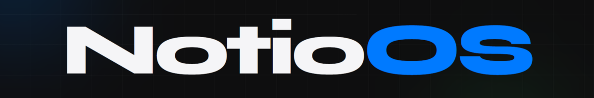
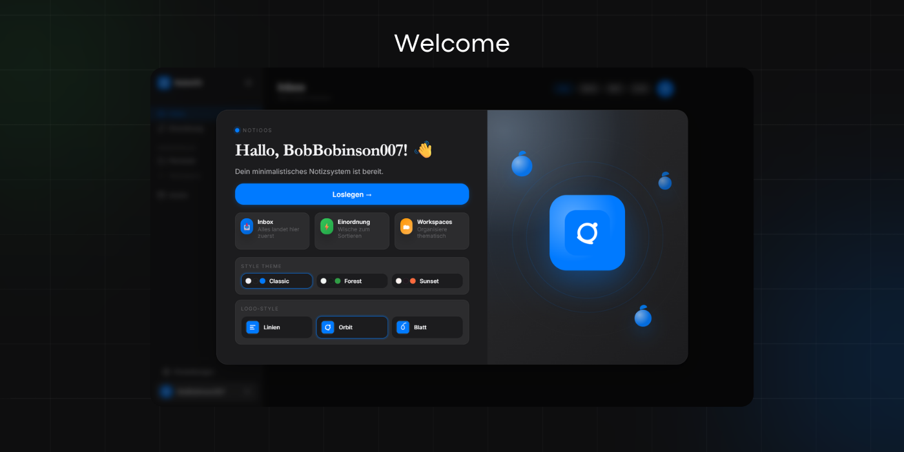
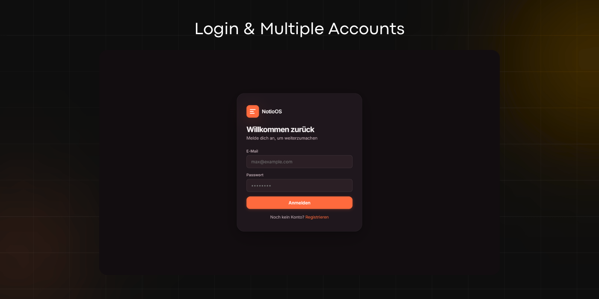
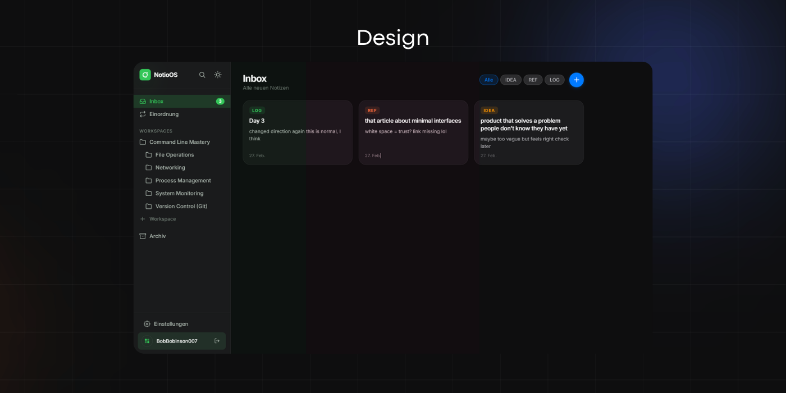
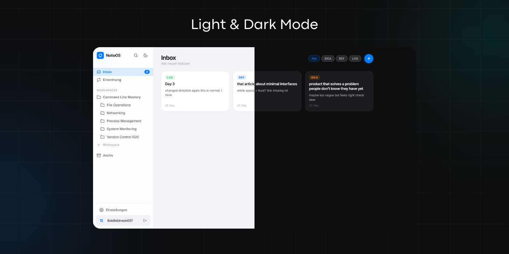
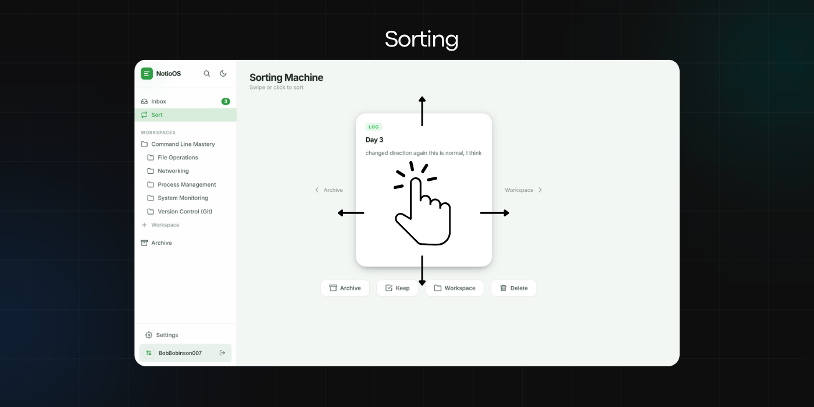
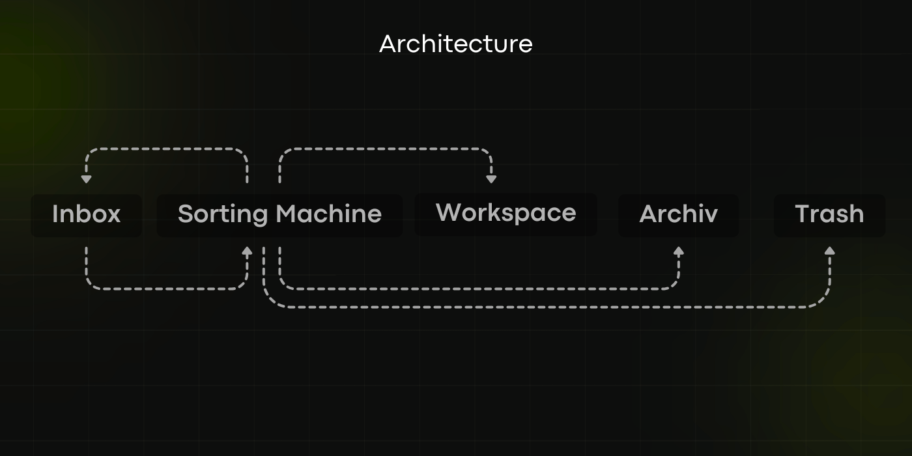

# NotioOS – Just Notes



[Audio German](docs/a1.mp3)

NotioOS is a high-performance, minimalist productivity platform inspired by modern design principles. It provides a streamlined environment for information capture, organization, and retrieval, prioritizing user experience and data security.

---

## The Onboarding Experience

The platform features a sophisticated welcome interface designed to guide users through their initial interaction. The onboarding process is engineered for efficiency, allowing users to establish their personal knowledge base with minimal friction.

## Authentication and Security

NotioOS implements a robust security architecture. User access is managed via JSON Web Token (JWT) authentication, supported by secondary verification layers. Multi-factor authentication options, including Time-based One-Time Password (TOTP) and Email-based OTP, ensure that sensitive data remains protected against unauthorized access. The system is also designed to handle multiple independent user accounts securely.

## Design Philosophy and Visual Identity

The visual identity of NotioOS is rooted in the "less is more" philosophy. Users can personalize their environment with curated color palettes—such as Forest and Sunset—that harmonize with the overall aesthetic while maintaining legibility and focus.

## Environmental Adaptability: Light and Dark Modes

To accommodate various lighting conditions and user preferences, NotioOS offers meticulously calibrated Light and Dark modes. Both themes utilize advanced CSS techniques, including glassmorphism and subtle elevation shadows, to create a premium, depth-rich interface that reduces eye strain during extended use.

## The Information Sorting Engine

The Sorting Engine is the core organizational component of NotioOS. It utilizes optimized pointer event handling to provide fluid, gesture-based interactions. The system recognizes specific directional inputs to facilitate rapid categorization:
- **Left Transformation**: Dispatches the item to the Archive for long-term storage.
- **Right Transformation**: Assigns the item to a specific Workspace for active project management.
- **Upward Transformation**: Retains the item within the Inbox for further consideration.
- **Downward Transformation**: Initiates a permanent deletion sequence, complete with a security confirmation dialog.

## Architectural Framework

The NotioOS workflow follows a logical progression of data management:
1. **Inbox (Capture)**: The primary entry point for all unstructured data.
2. **Sorting Engine (Categorization)**: The decision-making layer where data is evaluated.
3. **Workspace/Archive (Persistence)**: The structured repository for organized knowledge.
4. **Trash (Cleanup)**: Ensuring a cluttered-free environment by removing redundant data.

---

## Technical Specifications
- **Client-Side**: Vanilla JavaScript (ES6+), Semantic HTML5, Custom CSS with Glassmorphism.
- **Server-Side**: Node.js / Express.js.
- **Data Persistence**: SQLite managed via the `better-sqlite3` library.
- **Security & Cryptography**: JWT, speakeasy (MFA), bcryptjs.
- **Internationalization**: Comprehensive i18n support utilizing a custom translation framework.

---

## Deployment and Installation

To deploy a local instance of NotioOS, ensure Node.js is installed on your system and follow these steps:

1. **Clone the repository**:
   ```bash
   git clone https://github.com/BobBinson007/NotioOS.git
     ```
2. **Install dependencies**:
   ```bash
   npm install
   ```
3. **Start the application**:
   ```bash
   npm start
   ```
4. **Access the application**:
   The system will be accessible at `http://localhost:3000`.

---

## License

This project is licensed under the MIT License. See the [LICENSE](LICENSE) file for details.

Copyright © 2026 NotioOS Project. All rights reserved. Professional Grade Documentation.
